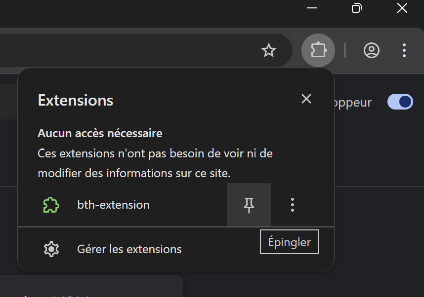
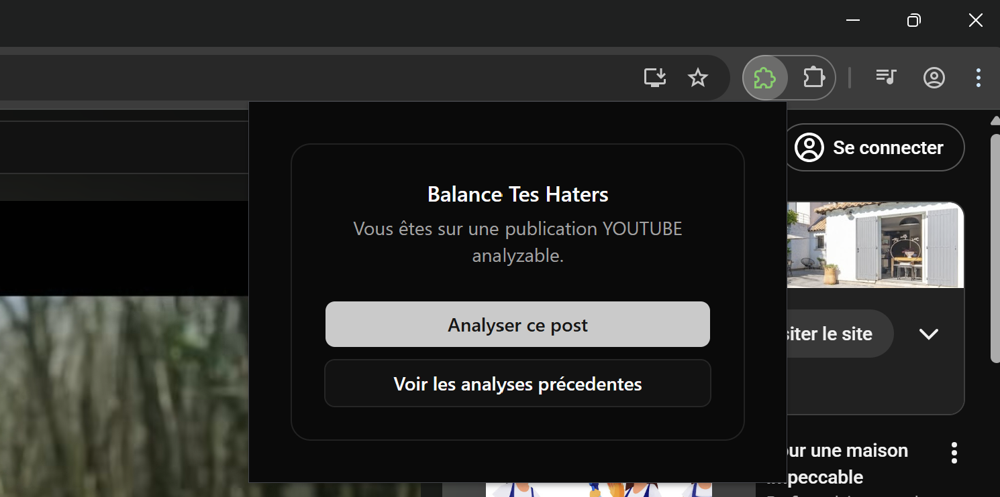

# Extension Navigateur Balance Tes Haters

Cette extension permet de capturer les commentaires depuis des publications réseau sociaux.

# Pour contribuer

Voir [./CONTRIBUTING.md](./CONTRIBUTING.md)

# Installer l'extension

Pour installer en mode dev voir [./CONTRIBUTING.md](./CONTRIBUTING.md)

Pour installer depuis un zip:

- Télécharger le zip localement
- Dézipper 2x?
  - le contenu vers un répertoire local et copier le chemin vers le répertoire local
- Ouvrir Google Chrome
- Accéder à la page "Extensions" en cliquant sur le meu "..." > "Extensions" > "Gérer les extensions":
- Activez le mode développeur bouton en haut à droite
- Cliquez sur le bouton Charger l'extension non empaquetée, puis sélectionnez le répertoire ou l'extension à été dézipé plus haut.
  
  

* Epingler l'extension en cliquant sur le bouton puzzle puis sur l'épingle à coté de l'extension
  

# Utiliser l'extension

## Faire une capture

1. Naviguer vers une pulicaiton pour laquelle une capture est supportée:
   - Pour youtube il s'agit d'une vidéo avec une url de la forme https://www.youtube.com/watch?v=videoid
   - Pour instagram il s'agit d'un post avec une url de la forme instagram.com/p/C56ZonItOfO/
2. Lancer la capture en cliquant sur le bouton de l'extension à coté de la barre d'adresse puis sur "Analyser ce post" dans la popup
   

## Voir les résultat

Cliquer sur le bouton de l'extension à coté de la barre d'adresse puis sur "Voir les analyses précedentes" dans la popup
