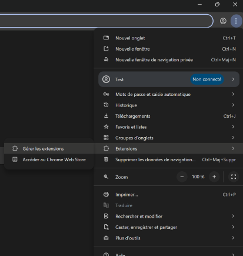
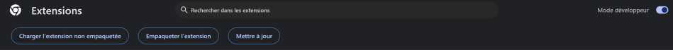
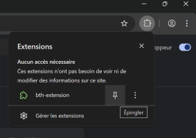

# Installer l'extension depuis le Chrome Web store

[Installer l'extension](https://chromewebstore.google.com/detail/bjmmakmdjbdlhghmjobpcnmeefhfajfe) depuis le Chrome Web Store

# Contribuer au développement

Voir [./CONTRIBUTING.md](./CONTRIBUTING.md)

# Installer l'extension depuis une build de dev

Pour installer depuis un zip de dev:

- Télécharger le zip
  - Pour la dernière version de dev: https://github.com/dataforgoodfr/14_BalanceTesHaters/releases/download/extension-latest/bth-extension-latest-chrome.zip
  - Les PR contiennent un lien vers un artifact de build
- Dézipper le fichier et copier le chemin vers le répertoire dézippé
- Ouvrir Google Chrome
- Accéder à la page "Extensions" en cliquant sur le menu "..." > "Extensions" > "Gérer les extensions":
- Activez le mode développeur en cliquant sur le bouton en haut à droite
- Cliquez sur le bouton "Charger l'extension non empaquetée", puis sélectionnez le répertoire où l'extension a été dézippée plus haut.
  
  

3. Épingler l'extension en cliquant sur le bouton puzzle puis sur l'épingle à côté de l'extension
   
