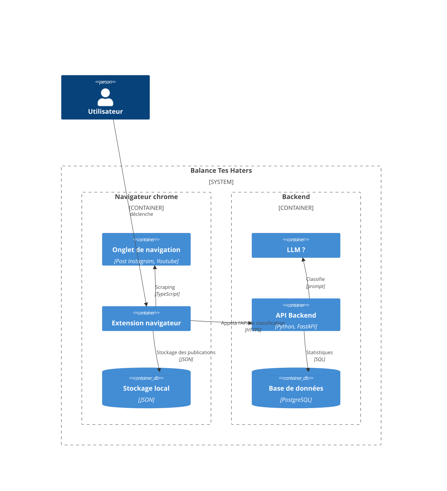

# Composants du système

_Extension navigateur_ : WebExtension chrome
 - Extension chrome de scraping des données des publications
 - Sur déclenchement de l'utilisateur : analyse l'onglet courant pour rechercher l'ensemble des commentaires d'une publication Instagrame, Youtube
 - les données scrapées sont transmises au backend via l'API d'analyse
 - le résultat est stocké en stockage local et utilisé par l'extension pour générer un rapport d'analyse

_Stockage local_ : Stockage de l'historique des publications analysées dans le navigateur
 - utilise l'[API de stockage du navigateur](https://developer.chrome.com/docs/extensions/reference/api/storage?hl=fr)

_API Backend_ : Composant serveur
 - fournit le service API d'analyse des publications (analyse et classification LLM des commentaires, statistiques, ...)

_Base de données_ : Stockage des données selon le [modèle](./backend/model.md).

_LLM_ : Composant en charge de l'exécution des traitements de classification

