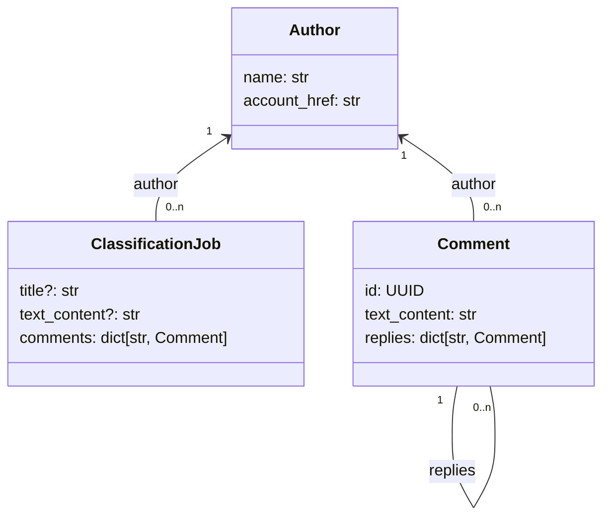
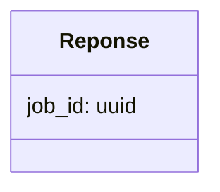
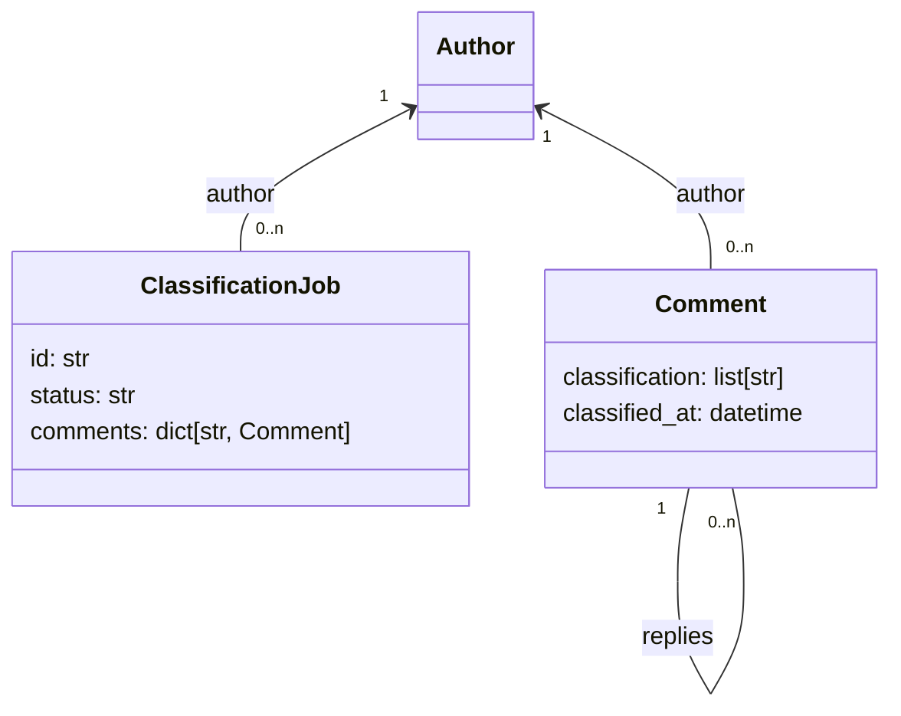

# `POST /classification`

Soumet au backend un Job de classification d'un post et de ses commentaires

## Requête 


Exemple: 
```
{
    "text_content": "⚡️⚡️⚡️LA @barbarabutch ⚡️⚡️⚡️au @petitpalais_musee (!) pour @carambaculturelive ❤️🌈 \"chez Barbara\" le 28 novembre au Petit Palais en partenariat avec @hbomaxfr Merci @viemorgane 🥰🐼 MUA @julieau_makeup.n.paintStylism @appellemoisarah Hair @yann.fontaine.coiffure",
    "author": {
        "name": "lynnnsk",
        "account_href": "https://www.instagram.com/lynnnsk/"
    },
    "comments": {
        "0698ce2e-2716-7d7e-8000-5f7481c5d55a": {
            "text_content": "😍💓",
            "author": {
                "name": "julieau_makeup.n.paint",
                "account_href": "https://www.instagram.com/julieau_makeup.n.paint/"
            }
        },
        "0698ce2e-2716-7e37-8000-a9362feb377d": {
            "text_content": "Super vidéo",
            "author": {
                "name": "gros.lourd",
                "account_href": "https://www.instagram.com/gros.lourd/"
            },
            "replies": {
                "0698ce2e-2716-7e69-8000-f012d86bb1b4": {
                    "text_content": "Ouai, génial !!",
                    "author": {
                        "name": "petit.lapin",
                        "account_href": "https://www.instagram.com/petit.lapin/"
                    }
                }
            }
        }
    }
}
```

## Réponse

Identifiant unique du job soumis au backend



Exemple:
```
{'job_id': '0698ce2e-2708-7030-8000-2a4bac70cb66'}
```
# `GET /classification/{job_id}`

Interroge le backend pour connaitre le statut et le résultat d'un job de classification.

## Requête

`job_id` : identifiant du job à interrogé

## Réponse



`status` peut avoir les valeurs:
 - `SUBMITTED`: le job vient d'être soumis au backend et pas encore traité
 - `IN_PROGRESS`: classification en cours
 - `COMPLETED` / `FAILED` : la classification est terminé en succès / en échec.

Exemple: 
```
{
    "id": "0698cee8-dce2-79a5-8000-3bed6b870158",
    "status": "COMPLETED",
    "comments": {
        "0698ce2e-2716-7d7e-8000-5f7481c5d55a": {
            "classification": ["Catégorie 1"],
            "classified_at": "2026-02-11T19:54:10.920Z"
        }
        "0698ce2e-2716-7e37-8000-a9362feb377d": {
            "classification": ["Catégorie 2", "Catégorie 3"],
            "classified_at": "2026-02-11T19:54:10.920Z"
        },
        "0698ce2e-2716-7e69-8000-f012d86bb1b4": {
            "classification": [],
            "classified_at": "2026-02-11T19:54:10.920Z"
        }

    }
}
```
