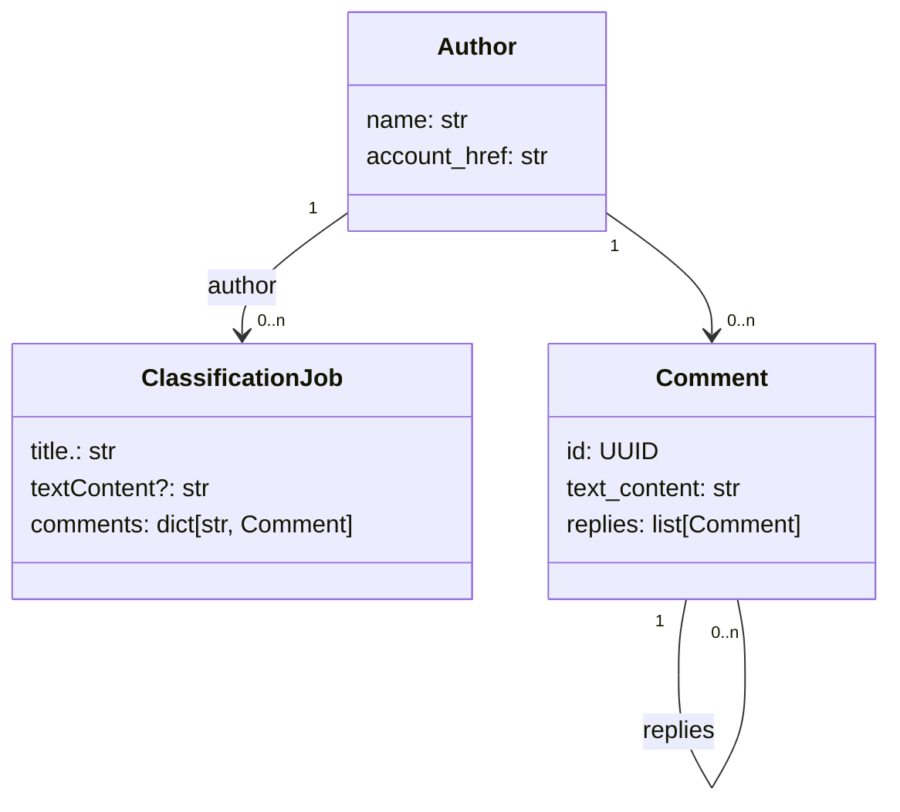

# `POST /classification`

Soumet au backend un Job de classification d'un post et de ses commentaires

## Requête 


Exemple: 
```
{
    "textContent": "⚡️⚡️⚡️LA @barbarabutch ⚡️⚡️⚡️au @petitpalais_musee (!) pour @carambaculturelive ❤️🌈 \"chez Barbara\" le 28 novembre au Petit Palais en partenariat avec @hbomaxfr Merci @viemorgane 🥰🐼 MUA @julieau_makeup.n.paintStylism @appellemoisarah Hair @yann.fontaine.coiffure",
    "author": {
        "name": "lynnnsk",
        "accountHref": "https://www.instagram.com/lynnnsk/"
    },
    "comments: [
        {
            "0698ce2e-2716-7d7e-8000-5f7481c5d55a": {
                "textContent": "😍💓",
                "author": {
                    "name": "julieau_makeup.n.paint",
                    "accountHref": "https://www.instagram.com/julieau_makeup.n.paint/"
                }
            }
        },
        {
            "0698ce2e-2716-7e37-8000-a9362feb377d": {
                "textContent": "Super vidéo",
                "author": {
                    "name": "gros.lourd",
                    "accountHref": "https://www.instagram.com/gros.lourd/"
                }
            }
        }
    ]
}
```

## Réponse

Identifiant unique du job soumis au backend


Exemple:
```
{'job_id': '0698ce2e-2708-7030-8000-2a4bac70cb66'}
```
