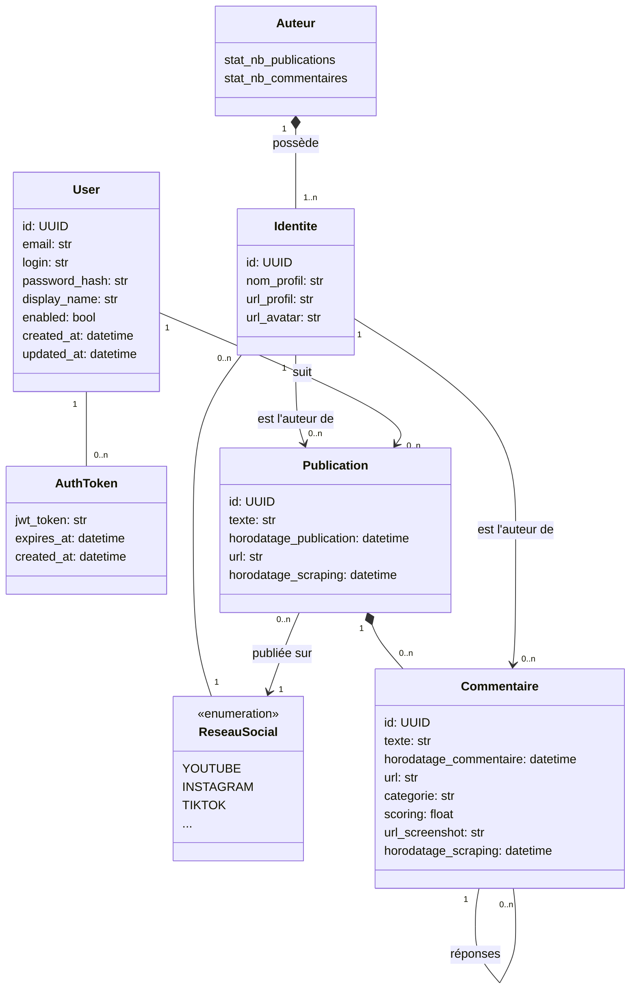

# Modèle de données

`User` : Utilisateur de la plate-forme _Balance tes haters_. 
- Dispose d'un login et d'un mot de passe
- Doit s'authentifier pour utiliser la plate-forme et l'API

`AuthToken` : Token d'autenfication associé à un utilisateur de la plate-forme
- Obtenu via un appel à l'API `/auth/login`
- Expire après un temps paramétrable
- est généré sous la forme d'un token JWT

`Publication` : Publication d'un auteur posté sur un réseau social

`Commentaire` : Commentaire posté par un auteur sur une publication

`Auteur`: Auteur d'une publication ou d'un commentaire

`Identité` : Identité d'un auteur sur un réseau social (pseudo et URL)