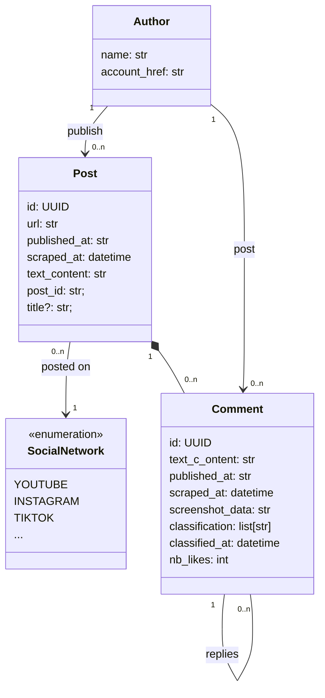

# Modèle de données

`Post` : Publication d'un auteur posté sur un réseau social

`Comment` : Commentaire posté par un auteur sur une publication

`Author`: Auteur d'une publication ou d'un commentaire