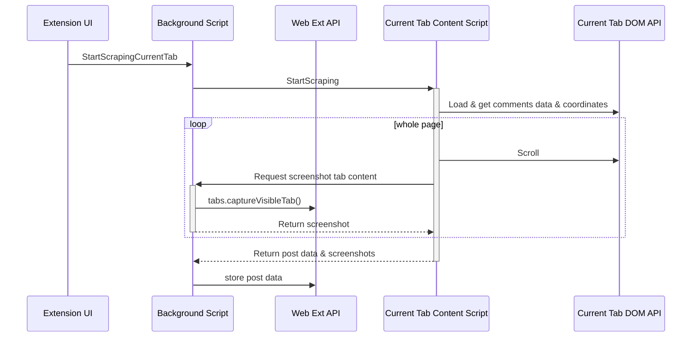

# Architecture scraping

Le scraping est basé sur l'éxécution de [content script](https://developer.mozilla.org/en-US/docs/Mozilla/Add-ons/WebExtensions/Content_scripts) dans le contexte de la page du réseau social.

Le content script manipule la page par le biais de l'API DOM pour:
* Préparer le contenu de la page (charger tous les commentaires, étendre les réponses aux commentaires...)
* Récupérer le contenu textuel des commentaires
* Récupérer les coordonnées des élements pour lesquels des captures d'écran sont nécéssaire
* Faire les captures d'écran par le biais du [background script](https://developer.mozilla.org/en-US/docs/Mozilla/Add-ons/WebExtensions/Background_scripts) car l'api captureVisibleTab n'est  disponible que pour depuis le background script. 

## Diagramme de séquence du scraping

## Communication inter "environnement"

La communication entre l'interface de l'extension, le background script et le content script se font par l'API de messaging ([runtime.sendMessage](https://developer.mozilla.org/en-US/docs/Mozilla/Add-ons/WebExtensions/API/runtime/sendMessage),[runtime.onMessage](https://developer.mozilla.org/en-US/docs/Mozilla/Add-ons/WebExtensions/API/runtime/onMessage), [tabs.sendMessage](https://developer.mozilla.org/en-US/docs/Mozilla/Add-ons/WebExtensions/API/tabs/sendMessage))

## Manipulation du DOM et éxécution JS de la page hôte 

Il est à noter que:
* la manipulation du DOM de la page hôte (scroll, click...) depuis le content script prend effet immédiatement.
* cependant le javascript de la page hôte qui pourrait répondre à ces changements ne s'éxécutera que lorsque la "tâche" js du content script se terminera et que la queue js traitera l'évènement de la page hôte.

Il est donc nécéssaire d'attendre des actions asynchrone dans le content script pour que le JS de la page puisse s'exécuter. 