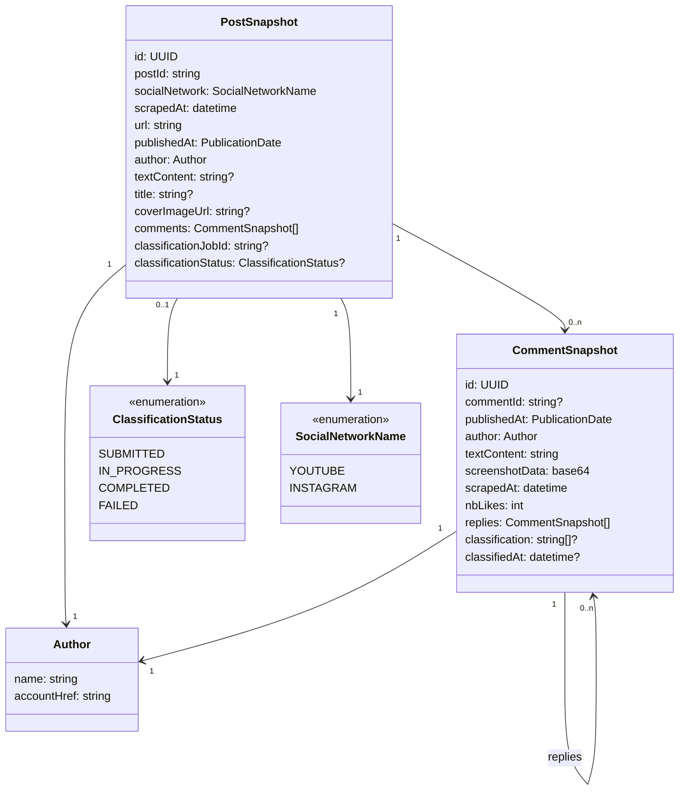

# Modèle de données pour le stockage côté client (Extension navigateur)

## Schéma



## Exemple

```json
{
  "id": "550e8400-e29b-41d4-a716-446655440000",
  "url": "https://www.instagram.com/p/DRTE4OmAvUN/",
  "socialNetwork": "INSTAGRAM",
  "postId": "DRTE4OmAvUN",
  "scrapedAt": "2026-01-03T14:52:01.000Z",
  "publishedAt": {
    "type": "absolute",
    "date": "2025-11-21T05:04:01.000Z"
  },
  "textContent": "⚡️⚡️⚡️LA @barbarabutch ⚡️⚡️⚡️ au @petitpalais_musee (!) pour @carambaculturelive ❤️🌈",
  "author": {
    "name": "lynnnsk",
    "accountHref": "https://www.instagram.com/lynnnsk/"
  },
  "classificationJobId": "job-123",
  "classificationStatus": "COMPLETED",
  "comments": [
    {
      "id": "440f0000-e29b-41d4-a716-446655440001",
      "commentId": "comment-instagram-123",
      "textContent": "😍💓",
      "publishedAt": {
        "type": "absolute",
        "date": "2025-11-21T07:21:06.000Z"
      },
      "screenshotData": "<base64 encoded PNG>",
      "scrapedAt": "2026-01-03T14:52:01.000Z",
      "author": {
        "name": "julieau_makeup.n.paint",
        "accountHref": "https://www.instagram.com/julieau_makeup.n.paint/"
      },
      "nbLikes": 42,
      "classification": ["A caractère sexuel", "Injures et diffamation"],
      "classifiedAt": "2026-01-03T15:52:01.000Z",
      "replies": []
    }
  ]
}
```
