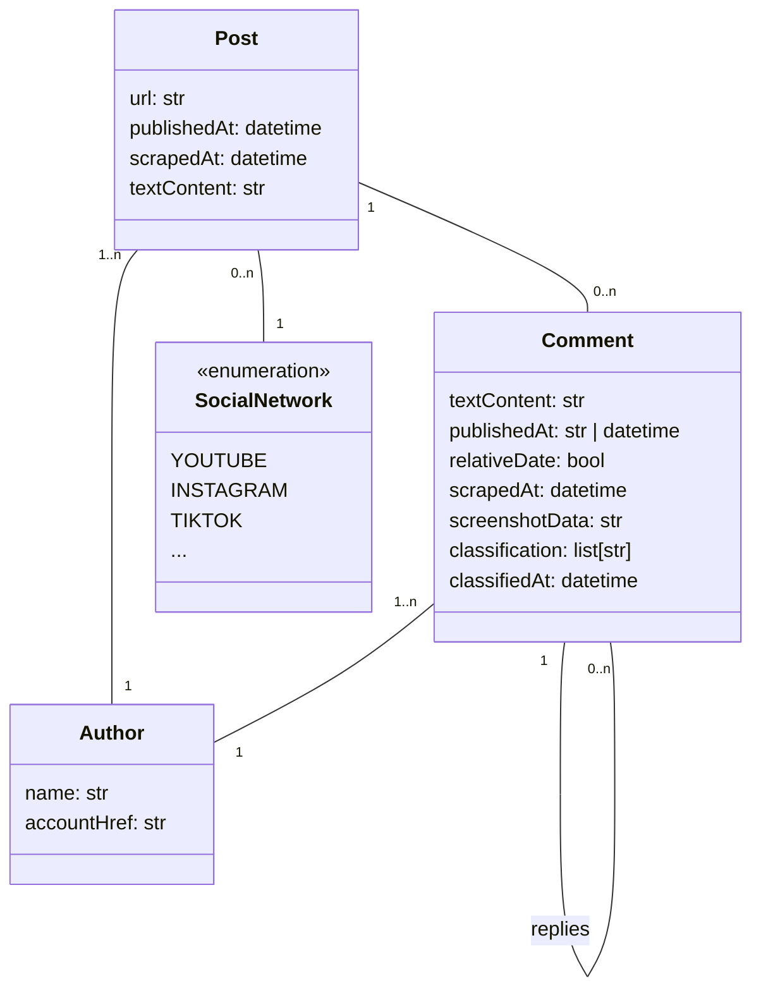

# Modèle de données pour le stockage côté client (Extension navigateur)

## Schéma


## Exemple

```
{
    "posts:" [
        {
            "url": "https://www.instagram.com/p/DRTE4OmAvUN/",
            "socialNetwork": "INSTAGRAM",
            "scrapedAt": "2026-01-03T14:52:01.000Z",
            "publishedAt": "2025-11-21T05:04:01.000Z",
            "textContent": "⚡️⚡️⚡️LA @barbarabutch ⚡️⚡️⚡️au @petitpalais_musee (!) pour @carambaculturelive ❤️🌈 \"chez Barbara\" le 28 novembre au Petit Palais en partenariat avec @hbomaxfr Merci @viemorgane 🥰🐼 MUA @julieau_makeup.n.paintStylism @appellemoisarah Hair @yann.fontaine.coiffure",
            "author": {
                "name": "lynnnsk",
                "accountHref": "https://www.instagram.com/lynnnsk/"
            },
            "comments: [
                {
                    "textContent": "😍💓",
                    "publishedAt": "2025-11-21T07:21:06.000Z",
                    "relativeDate": "false",
                    "screenshotData": "<PNG encodé base64>"
                    "scrapedAt": "2026-01-03T14:52:01.000Z"
                    "author": {
                        "name": "julieau_makeup.n.paint",
                        "accountHref": "https://www.instagram.com/julieau_makeup.n.paint/"
                    },
                    "classification": ["A caractère sexuel", "Injures et diffamation"]
                    "classifiedAt: "2026-01-03T15:52:01.000Z"
                },
                ...
            ],
        },
        {
            "url": "https://www.youtube.com/...",
            "socialNetwork": "YOUTUBE",
            "scrapedAt": "2026-01-03T14:52:01.000Z",
            "publishedAt": "2026-01-03T02:18:01.000Z",
            "comments: [
                {
                    "textContent": "Super vidéo !",
                    "publishedAt": "Il y a 1 jour",
                    "relativeDate": "true",
                    "screenshotData": "<PNG encodé base64>"
                },
        }
    ],
    "config": {
        "url_backend": "https://balances.tes.haters/api/"
    }
}
```