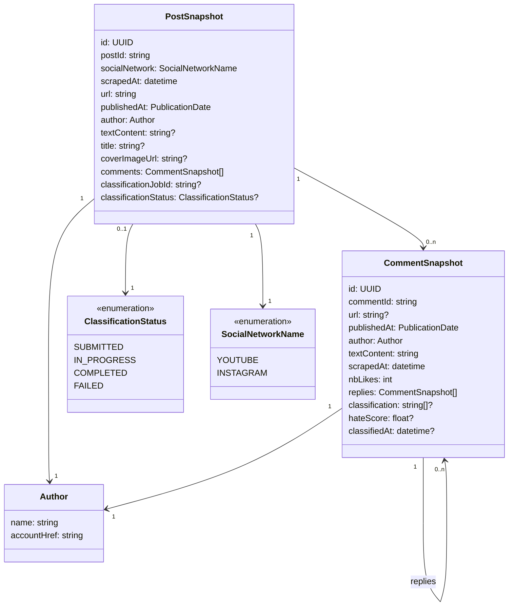

# Modèle applicatif côté client

Ce document décrit les objets métier manipulés par l'extension. Une collecte
peut produire plusieurs milliers de screenshots. Ils font partie du
métier, mais leurs données sont chargées séparément pour limiter la consommation
mémoire.

Le format de persistance des PostsSnapshot est décrit dans [Stockage côté client](./post-storage-v2.md).

## Snapshots de collecte (PostSnapshot)


```mermaid
classDiagram
    class PostSnapshot {
        id: UUID

        postId: string
        socialNetwork: SocialNetworkName
        scrapedAt: datetime

        url: string
        publishedAt: PublicationDate
        author: Author
        textContent: string?
        title: string?
        coverImageUrl: string?
        comments: CommentSnapshot[]

        classificationJobId: string?
        classificationStatus: ClassificationStatus?
    }


    class CommentSnapshot {
        id: UUID
        commentId: string
        url: string?

        publishedAt: PublicationDate
        author: Author

        textContent: string
        scrapedAt: datetime
        nbLikes: int
        replies: CommentSnapshot[]

        classification: string[]?
        hateScore: float?
        classifiedAt: datetime?
    }


    class Author {
        name: string
        accountHref: string
    }

    class ClassificationStatus {
        <<enumeration>>
        SUBMITTED
        IN_PROGRESS
        COMPLETED
        FAILED
    }

    class SocialNetworkName {
        <<enumeration>>
        YOUTUBE
        INSTAGRAM
    }


    PostSnapshot "1" --> "1" Author
    PostSnapshot "1" --> "1" SocialNetworkName
    PostSnapshot "1" --> "0..n" CommentSnapshot
    PostSnapshot "0..1" --> "1" ClassificationStatus
    CommentSnapshot "1" --> "1" Author
    CommentSnapshot "1" --> "0..n" CommentSnapshot : replies
```

### Exemple JSON

```json
{
  "id": "550e8400-e29b-41d4-a716-446655440000",
  "url": "https://www.instagram.com/p/DRTE4OmAvUN/",
  "socialNetwork": "INSTAGRAM",
  "postId": "DRTE4OmAvUN",
  "scrapedAt": "2026-01-03T14:52:01.000Z",
  "publishedAt": {
    "type": "absolute",
    "date": "2025-11-21T05:04:01.000Z"
  },
  "textContent": "⚡️⚡️⚡️LA @barbarabutch ⚡️⚡️⚡️ au @petitpalais_musee (!) pour @carambaculturelive ❤️🌈",
  "author": {
    "name": "lynnnsk",
    "accountHref": "https://www.instagram.com/lynnnsk/"
  },
  "classificationJobId": "job-123",
  "classificationStatus": "COMPLETED",
  "comments": [
    {
      "id": "440f0000-e29b-41d4-a716-446655440001",
      "commentId": "comment-instagram-123",
      "textContent": "😍💓",
      "publishedAt": {
        "type": "absolute",
        "date": "2025-11-21T07:21:06.000Z"
      },
      "scrapedAt": "2026-01-03T14:52:01.000Z",
      "author": {
        "name": "julieau_makeup.n.paint",
        "accountHref": "https://www.instagram.com/julieau_makeup.n.paint/"
      },
      "nbLikes": 42,
      "classification": ["A caractère sexuel", "Injures et diffamation"],
      "hateScore": 0.9321,
      "classifiedAt": "2026-01-03T15:52:01.000Z",
      "replies": []
    }
  ]
}
```

## Model résultat du scraping

`CommentSnapshot` ne contient pas les données d'un screenshot.
Le scraper retourne le snapshot et les screenshots dans deux propriétés distinctes :
```ts
type PostScrapingResult = {
  postSnapshot: PostSnapshot;
  screenshots: Record<CommentSnapshot["id"], string>;
};
```

La clé de `screenshots` est `CommentSnapshot.id`, l'UUID propre à cette
collecte. Il ne s'agit pas de `CommentSnapshot.commentId`, qui identifie le
commentaire sur le réseau social et peut être commun à plusieurs snapshots. Le
`postSnapshotId` n'est pas répété pour chaque screenshot puisqu'il est déjà porté
par `postSnapshot.id`.


## Modèle consolidé (Post, PostComment)

`Post` et `PostComment` consolident plusieurs
snapshots et portent les règles de déduplication ainsi que les notions de
commentaire ajouté ou supprimé. Un `PostComment` référence le screenshot retenu
comme preuve, sans contenir ses données :

```ts
type CommentScreenshotRef = {
  postSnapshotId: PostSnapshot["id"];
  commentSnapshotId: CommentSnapshot["id"];
};

type PostComment = CommentSharedProperties & {
  screenshotRef?: CommentScreenshotRef;
  isNew: boolean;
  isDeleted: boolean;
};
```
