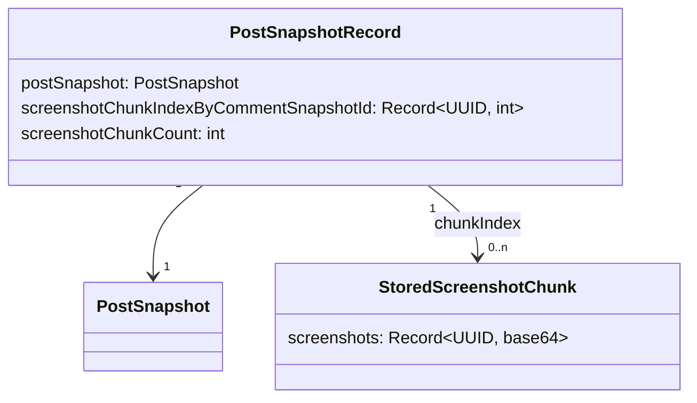

# Stockage PostSnapshot côté client

Ce document décrit la persistance des snapshots et des screenshots dans
`browser.storage.local`. Les objets métier sont définis dans le
[modèle applicatif](./model.md).

## Problème du format historique

Le format historique stocke tous les `PostSnapshot`, leurs commentaires et
leurs screenshots dans une seule clé `posts` de
`browser.storage.local`.

Cette organisation impose de charger en mémoire la totalité de l'objet à chaque
lecture, ajout ou modification.

Avec 100 snapshots de 1 000 commentaires et la moyenne observée de 30 ko par
screenshot, les screenshots occupent déjà environ 3 Go, sans compter le texte.

## Décisions

Le choix du format repose sur les critères suivants :

- une opération sur les métadonnées ou la classification ne doit pas charger
  de screenshot ;
- une opération sur un snapshot ne doit pas charger tous les snapshots ;
- la taille d'une valeur stockée doit rester bornée, y compris pour un snapshot
  de 5 000 commentaires ;
- le nombre de clés doit rester raisonable afin d'éviter des problèmes avec l'api local.storage
- le stockage doit rester accessible directement depuis les scripts de
  contenu ;
- les données historiques doivent être migrées.

Règles du stockage v2 :

- chaque snapshot est stocké dans une valeur distincte ;
- `PostSnapshot` et `CommentSnapshot` ne contiennent plus `screenshotData` ;
- les screenshots sont regroupés dans des chunks propres à un snapshot ;
- un chunk ne dépasse pas 2 Mo après sérialisation JSON, sauf lorsqu'une seule
  screenshot dépasse cette taille ;
- chaque commentaire stocké indique le chunk qui contient son screenshot ;
- une lecture ne charge aucun screenshot par défaut.

La limite de 2 Mo est une constante interne et non une propriété du modèle
métier :

```ts
const MAX_SCREENSHOT_CHUNK_BYTES = 2 * 1024 * 1024;
```

### Estimation du nombre de clés pour le stockage des chunks

Pour un cas extrême de 100 snapshots de 5 000 commentaires et un screenshot
moyenne de 30 ko, le stockage contiendrait environ 7 500 chunks. Ce nombre de
clés `storage.local` semble gérable.

## Solutions écartés

Les solutions suivantes ont été considérées :

- une seconde clé unique pour tous les screenshots conserve une valeur trop
  volumineuse et force leur chargement collectif ;
- une clé de screenshots par snapshot reste trop volumineuse pour une publication
  de plusieurs milliers de commentaires ;
- une clé par screenshot permet une lecture fine, mais peut produire 500 000 clés
  pour 100 snapshots de 5 000 commentaires ;
- IndexedDB stockerait les screenshots en binaire et fournirait des transactions,
  mais demanderait de centraliser le stockage dans le contexte de l'extension
  et de faire transiter les données des Content script vers le service worker par messages ;

## Stockage v2

Les clés sont :

```text
post-snapshots:storage-version
post-snapshots:v2:record:{postSnapshotId}
post-snapshots:v2:screenshot-chunk:{postSnapshotId}:{chunkIndex}
```

La liste des snapshots est obtenue avec `browser.storage.local.getKeys()`, puis
en filtrant les clés qui commencent par `post-snapshots:v2:record:`. `getKeys()`
ne retourne que les noms des clés et ne charge donc pas les chunks. Les valeurs
des enregistrements filtrés sont ensuite lues en un seul appel à `get()`.

### `post-snapshots:storage-version`

Cette clé contient le nombre `2` lorsque le stockage v2 est prêt à être lu :

```ts
type PostSnapshotsStorageVersion = 2;
```

L'absence de la clé indique soit un stockage historique v1 sous la clé `posts`,
soit un stockage vide qui doit être initialisé. La valeur `2` est écrite
uniquement après la migration de tous les snapshots. Une autre valeur est une
version inconnue et doit provoquer une erreur plutôt qu'une lecture avec le
mauvais schéma.

### `post-snapshots:v2:record:{postSnapshotId}`

Chaque clé contient un `PostSnapshotRecord`. Le `PostSnapshot` ne contient
aucune donnée base64. Une table séparée associe l'identifiant d'un commentaire à
l'index du chunk qui contient son screenshot :

```ts
type PostSnapshotRecord = {
  postSnapshot: PostSnapshot;
  screenshotChunkIndexByCommentSnapshotId: Partial<
    Record<CommentSnapshot["id"], number>
  >;
  screenshotChunkCount: number;
};
```

L'identifiant d'un commentaire est absent de
`screenshotChunkIndexByCommentSnapshotId` lorsqu'il n'a pas de screenshot.
`screenshotChunkCount` permet de construire les clés à supprimer sans parcourir
tout le stockage.

### `post-snapshots:v2:screenshot-chunk:{postSnapshotId}:{chunkIndex}`

Chaque clé contient un objet qui associe les identifiants des commentaires de
ce chunk à leur screenshot base64 :

```ts
type StoredScreenshotChunk = {
  screenshots: Record<CommentSnapshot["id"], string>;
};
```

### Data model



## Lecture des screenshots

Les fonctions de liste, de filtrage, de classification et de mise à jour des
statuts lisent les `PostSnapshotRecord` sans charger les chunks. La couche de
stockage expose des objets métier et conserve le `chunkIndex` en interne.

Le contrat de lecture peut être résumé par les opérations suivantes :

```ts
getPostSnapshotById(id): Promise<PostSnapshot | undefined>;
getScreenshot(
  ref: CommentScreenshotRef,
): Promise<string | undefined>;
getScreenshots(
  refs: CommentScreenshotRef[],
): Promise<ReadonlyMap<string, string>>;
```

`getScreenshot()` retourne directement le screenshot base64.
`getScreenshots()` retourne les screenshots indexés par la clé composite
`${postSnapshotId}:${commentSnapshotId}` produite par
`commentScreenshotRefKey()`. Les références sans screenshot sont absentes de
la map.

## Migration du format historique

L'absence de `post-snapshots:storage-version` indique un stockage historique.
Le background est le seul contexte autorisé à lancer la migration v1 vers v2.

L'UI et les content scripts lisent la version et attendent que la migration soit terminée avant de lire les données.

Le marqueur de version est le point de bascule. Tant qu'il n'existe pas, le
format historique reste la source de référence. Si le navigateur s'arrête après
l'écriture du marqueur mais avant la suppression de `posts`, le prochain
démarrage utilise v2 puis termine le nettoyage.
